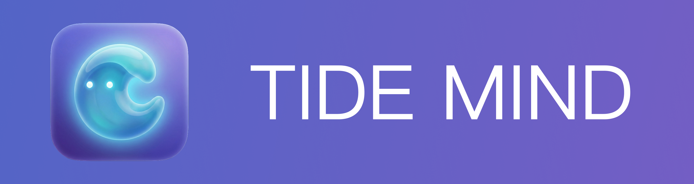
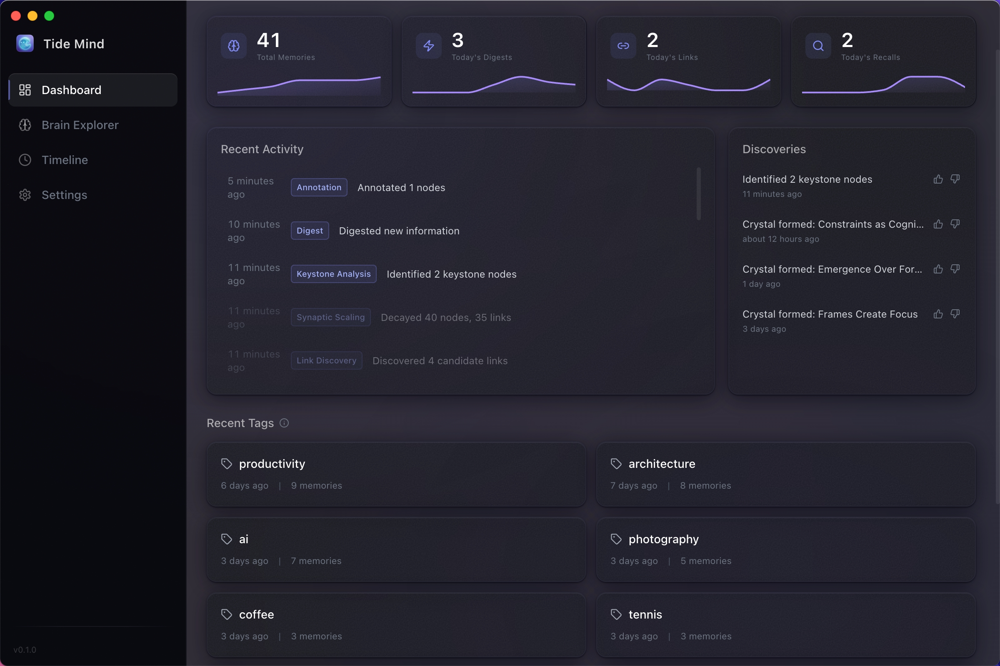
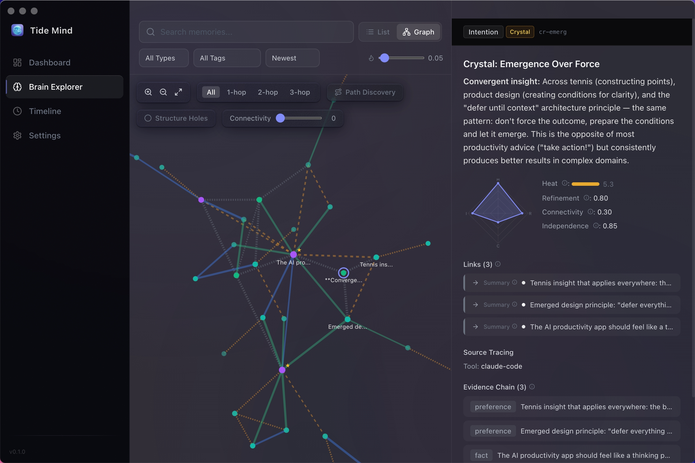
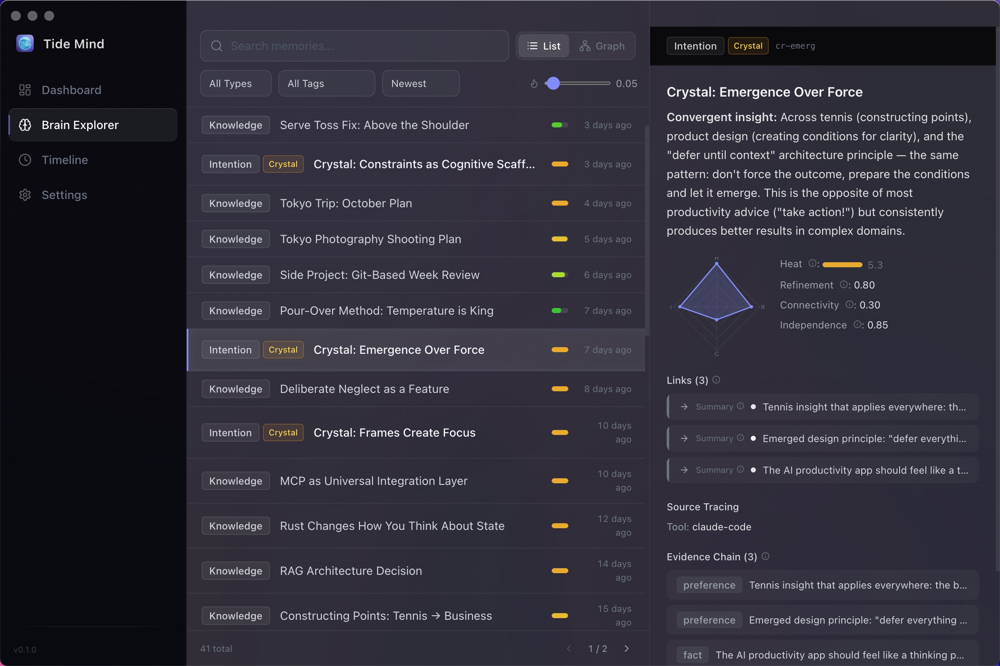

# TideMind

A living second brain that connects everything you think with — your AI agents, your notes, and whatever comes next.

[](LICENSE)
[](https://nodejs.org/)
[](https://modelcontextprotocol.io/)
[](docs/)
[](https://github.com/SawyerHan-AI/TideMind/discussions)

[English](README.md) | [中文](README_CN.md)

<p align="center">
  
</p>

## Why TideMind

**Your memory is scattered across a dozen tools, and none of them talk to each other.**

Claude remembers you like concise code, but Cursor has no idea. You spent a week organizing design thinking in Obsidian, but the next time you discuss it with an AI, it knows nothing. The rapport you built with one agent vanishes the moment you switch to another. Every tool quietly accumulates its own understanding of you, yet nothing connects them.

The deeper problem: even AIs that have built-in memory are just storing flat facts. They won't link a decision you made three months ago to the problem you're facing today. They won't let go of details that no longer matter. They won't discover patterns across your ideas that you haven't noticed yourself.

Existing memory tools — including open-source ones — are essentially vector databases. Store in, retrieve out. They've solved "cross-session memory," but not "memory should be alive." They never forget outdated information, never update memories when you retrieve them, never discover connections you didn't search for.

TideMind is a memory layer that spans all your tools — a living knowledge graph that connects your AI, your notes, and your thinking.

## What is TideMind

**All your AI tools share one persistent memory.** Connect through the MCP protocol — no tool switching, no habit changes. Install and go.

**A living system, not a database.** Memories naturally decay when unused — signal stays, noise fades. Every recall strengthens and updates the memory it touches — reading is writing. And in the background, the system actively discovers connections between ideas you never realized were related.

**Your AI navigates a knowledge graph, not a search index.** Instead of guessing the right keywords for a top-K search, AI can follow links between memories — from a decision to the discussion behind it, to later changes it influenced. It starts with a few relevant nodes and explores deeper on demand. No need to load everything; no risk of missing what matters.

**Your notes join the graph, your data stays local.** Logseq, Obsidian, and Apple Notes content enters the same graph alongside your AI conversations — connecting and cross-pollinating. Everything is stored in a single SQLite file on your machine, exportable to Markdown anytime. You choose the LLM and embedding models — fully local with Ollama, cloud with Claude or GPT, or mix both. Your data, your call.

## How it's different

|  | Typical AI Memory | TideMind |
|---|---|---|
| **Storage** | Flat list of facts | Living knowledge graph with typed links |
| **Recall** | Keyword / vector top-K | Graph navigation — follow links, explore on demand |
| **Forget** | Never (or manual delete) | Automatic decay — signal stays, noise fades |
| **On read** | Return results | Reconsolidate — memories evolve as you use them |
| **Discover** | Only what you search for | Divergent scanning — finds connections you missed |
| **Data** | Cloud / vendor-locked | Local SQLite file, export to Markdown anytime |

## Quick Start

### Prerequisites

- Node.js >= 18

That's the only hard requirement. TideMind runs out of the box with text search (BM25) and basic storage.

**Optional, for the full experience:**

- **An LLM provider** (Anthropic API Key, Google Vertex AI, or Gemini) — enables automatic information extraction, memory reconsolidation, divergent scanning, and crystal emergence. Without it, these features are simply skipped.
- **An embedding provider** (Ollama, Vertex AI, or Gemini) — enables semantic vector search alongside BM25. Without it, search falls back to keyword matching.
- You can mix and match: e.g., Ollama locally for embeddings + Anthropic for LLM, or go fully local, or fully cloud. See the [Integration Guide](docs/integrations.md) for details.

### Install

```bash
git clone https://github.com/SawyerHan-AI/tidemind.git
cd tidemind
npm install
npm run build
```

### Launch and Connect

```bash
npm start
```

Open the desktop client, then head to **Settings** to connect your AI tools and note systems with one click — no manual config file editing required.

> Also supports manual MCP configuration — see the [Integration Guide](docs/integrations.md).

That's it. Next time you open a conversation, your AI will remember you.

## How it works

### Active Graph

All information — AI conversations, note content, your preferences and decisions — lives as nodes and links in a single graph. Nodes aren't static index cards; they carry four maturity dimensions (activity, refinement, connectivity, independence) that together determine a memory's fate: reinforced, connected, crystallized, or forgotten.

[Learn more about the Active Graph model](docs/architecture.md)

### Three Cognitive Tools

TideMind exposes three tools via the MCP protocol, corresponding to three cognitive operations:

| Tool | What it does | When to use |
|------|-------------|-------------|
| `brain_prepare` | Load memory context | Start of every conversation |
| `brain_recall` | Navigate and retrieve memories | When you need historical context |
| `brain_digest` | Store new information | When something worth remembering emerges |

This isn't CRUD. Prepare is like opening a memory map. Recall is like remembering — and each recall strengthens the memory. Digest is like absorption — incoming information is decomposed, connected, and woven into the existing knowledge network.

`brain_recall` goes beyond search. AI can follow links between memories — starting from an architecture decision, jumping to the discussion behind it, then to later changes it triggered. Like walking through a knowledge network, not guessing keywords in a search box. It returns a small set of highly relevant nodes first, then expands along links when more context is needed — exploring on demand, never loading everything upfront.

[Learn more about the three tools](docs/api.md)

### Metabolism

TideMind continuously maintains the graph in the background, much like the brain organizes memories during sleep:

- **Daily**: Inactive memories gradually decay (but highly connected hub nodes are protected); candidate links are confirmed or pruned
- **Weekly**: Divergent scanning — discovering node pairs that share neighbors but lack direct links, evaluating whether hidden connections exist; highly connected information crystallizes into Crystals — distilled representations of your thinking patterns, behavioral preferences, and core decisions

Information isn't just stored. It's digested, organized, connected, and sometimes forgotten. That's what "living" means.

[Learn more about the metabolism system](docs/metabolism.md)

## Supported Integrations

### AI Tools

| Tool | Status | Notes |
|------|--------|-------|
| Claude Code | Supported | Native MCP support |
| Cursor | Supported | MCP configuration |
| Windsurf | Supported | MCP configuration |
| Codex | Supported | MCP configuration |
| Any MCP-compatible tool | Supported | Standard protocol, plug and play |

### Note Systems

| Source | Status | Notes |
|--------|--------|-------|
| Logseq | Supported | File watching, incremental sync, properties promoted to tags |
| Obsidian | Supported | Vault import, Canvas support, wikilink resolution |
| Apple Notes | Supported | Read-only sync, attachment text extraction |
| *More coming soon...* | | |

## Desktop Client

TideMind ships with a desktop client for browsing your knowledge graph, monitoring system metabolism, and tuning parameters. It's an inspection tool — for observing what your external brain is thinking, discovering, and forgetting.

The main interface of TideMind isn't this app. It's whatever AI tool you're already using.

<p align="center">
  
</p>
<p align="center"><em>Dashboard — real-time pulse of your second brain</em></p>

<p align="center">
  
</p>
<p align="center"><em>Brain Explorer — visualize how your memories connect across domains</em></p>

<p align="center">
  
</p>
<p align="center"><em>Memory detail — four-dimensional maturity model and evidence chains</em></p>

## Documentation

| Document | Description |
|----------|-------------|
| [Design Philosophy](docs/design-philosophy.md) | From Bush (1945) to Clark & Chalmers (1998) — the cognitive science behind TideMind |
| [Architecture](docs/architecture.md) | Active Graph model, four maturity dimensions, link type system |
| [Metabolism & Self-Evolution](docs/metabolism.md) | Decay mechanics, divergent scanning, crystal emergence, three-tier learning |
| [Integration Guide](docs/integrations.md) | Detailed setup for each AI tool and note system |
| [API Reference](docs/api.md) | Full parameter documentation for prepare / recall / digest |

## Contributing

Contributions of all kinds are welcome. See [CONTRIBUTING.md](CONTRIBUTING.md) to get started.

## License

[MIT](LICENSE)

---

*Inspired by 80 years of cognitive science — from Bush's Memex to modern memory reconsolidation research.*
