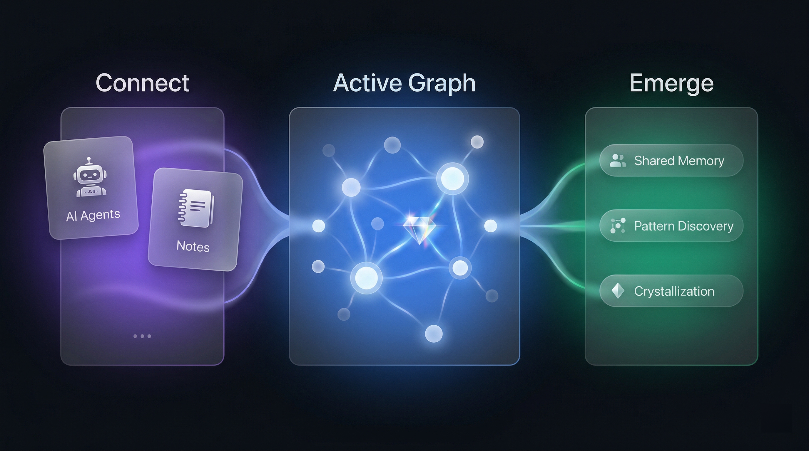

<p align="center">
  
</p>

<p align="center">一个活的第二大脑，连接你用来思考的一切——你的 AI 助手、你的笔记、以及未来更多的东西。</p>

<p align="center">

[](LICENSE)
[](https://nodejs.org/)
[](https://modelcontextprotocol.io/)
[](docs/)
[](https://github.com/SawyerHan-AI/TideMind/discussions)

</p>

<p align="center">
  <a href="README.md">English</a> | <strong>中文</strong>
</p>

<p align="center">
  
</p>

## 为什么需要 TideMind

**你的记忆散落在十几个工具里，互相不通。**

Claude 记得你喜欢简洁的代码风格，但 Cursor 不知道。你在 Obsidian 里整理了一周的设计思路，但下次和 AI 讨论时它一无所知。你和一个 Agent 建立的默契，换一个又要重新来过。每个工具都在各自积累对你的了解，却没有任何东西把它们连起来。

更根本的问题是：现有的 AI 记忆只是在存储事实。它不会把你三个月前的一个决策和今天遇到的问题联系起来，不会遗忘不再重要的细节，不会在你的想法之间发现你自己都没注意到的模式。

现有的记忆工具——包括开源方案——本质上是向量数据库：存进去什么，取出来什么。它们解决了"跨会话记忆"，但没有解决"记忆应该是活的"。不会遗忘过时的信息，不会在你检索时更新记忆，不会主动发现你没搜索过的关联。

TideMind 是一个跨越所有工具的记忆层——一张活的知识图谱，让你的 AI、你的笔记、你的思考真正连接在一起。

## TideMind 是什么

**所有 AI 工具共享同一份持久记忆。** 通过 MCP 协议接入，不需要换工具、不需要改习惯——装上就用。

**不是数据库，是一个活的系统。** 不被使用的记忆自然衰减——信号留下，噪音消退。每次检索都在强化和更新被触及的记忆——读即写。在后台，系统还会主动发现你从未意识到的想法之间的联系。

**AI 在知识图谱里导航，而不是在搜索框里猜关键词。** AI 可以沿着记忆之间的链接顺藤摸瓜——从一个决策出发，跳到当时的讨论背景，再跳到后来的变更。不需要加载全部记忆，也不会遗漏间接相关的信息。先返回少量高相关节点，需要更多上下文时沿链接展开——按需探索。

**你的笔记接入图谱，你的数据留在本地。** Logseq、Obsidian、Apple Notes 的内容和 AI 对话一起进入同一张图，互相连接、互相激发。所有数据存在你电脑上的一个 SQLite 文件里，随时可以导出为 Markdown。LLM 和向量模型由你选择——Ollama 全本地、Claude/GPT 云端、或混合使用。你的数据，你做主。

## 和其他方案有什么不同

|  | 典型 AI 记忆 | TideMind |
|---|---|---|
| **存储** | 扁平的事实列表 | 活的知识图谱，带类型化链接 |
| **检索** | 关键词 / 向量 top-K | 图谱导航——沿链接探索，按需展开 |
| **遗忘** | 永不遗忘（或手动删除） | 自动衰减——信号留下，噪音消退 |
| **读取时** | 返回结果 | 再巩固——记忆在使用中进化 |
| **发现** | 只能找到你搜索过的 | 发散扫描——发现你遗漏的关联 |
| **数据** | 云端 / 供应商锁定 | 本地 SQLite 文件，随时导出 Markdown |

## 快速开始

### 前置条件

- Node.js >= 18

这是唯一的硬性要求。TideMind 开箱即用，默认使用文本搜索（BM25）和基础存储。

**可选，获得完整体验：**

- **LLM 服务**（Anthropic API Key、Google Vertex AI 或 Gemini）——启用自动信息提取、记忆再巩固、发散扫描、结晶涌现等功能。没有配置时，这些功能会被静默跳过。
- **向量嵌入服务**（Ollama、Vertex AI 或 Gemini）——启用语义向量搜索。没有配置时，搜索退化为关键词匹配，不影响其他功能。
- 可以混合搭配：比如本地 Ollama 做嵌入 + Anthropic 做 LLM，或全部本地，或全部云端。详见[集成指南](docs/integrations.md)。

### 安装

```bash
git clone https://github.com/SawyerHan-AI/tidemind.git
cd tidemind
npm install
npm run build
```

### 启动并连接

```bash
npm start
```

启动后打开桌面客户端，在「设置」中一键对接你的 AI 工具和笔记系统，无需手动编辑配置文件。

> 也支持手动配置 MCP——详见[集成指南](docs/integrations.md)。

就这些。下次打开对话，你的 AI 就能记住你了。

## 工作原理

### 活性图（Active Graph）

所有信息——AI 对话、笔记内容、你的偏好和决策——以节点和链接的形式存在同一张图里。节点不是静态的档案卡片；它们有四个维度的成熟度（活跃度、精炼度、连通度、独立度），这些维度共同决定了一条记忆的命运：被强化、被连接、被结晶，还是被遗忘。

[了解活性图模型的完整设计](docs/architecture.md)

### 三个认知工具

TideMind 通过 MCP 协议暴露三个工具，对应三个认知操作：

| 工具 | 做什么 | 什么时候用 |
|------|--------|-----------|
| `brain_prepare` | 加载记忆上下文 | 每次对话开始 |
| `brain_recall` | 导航和检索记忆 | 需要历史信息时 |
| `brain_digest` | 存入新信息 | 产生值得记住的内容时 |

这不是 CRUD。Prepare 像打开一张记忆地图，Recall 像回忆（而且每次回忆都会强化记忆），Digest 像消化吸收——信息进入后会被拆解、连接、融入已有的知识网络。

`brain_recall` 不只是搜索。AI 可以沿着记忆之间的链接探索——从一个架构决策出发，跳到当时的讨论背景，再跳到后来的变更。像在知识网络里散步，而不是在搜索框里猜关键词。初始只返回少量高相关节点，需要更多上下文时沿链接展开——按需探索，不预加载全部记忆。

[了解三工具的完整参数和行为](docs/api.md)

### 代谢系统

TideMind 在后台持续维护这张图，就像大脑在睡眠时整理白天的记忆：

- **日常**：不活跃的记忆逐渐衰减（但高连接度的枢纽节点受保护）；候选链接被确认或清理
- **每周**：发散扫描——发现有共同邻居但没有直接联系的节点对，评估它们之间是否存在你没有意识到的关联；高度连接的信息涌现为结晶（Crystal）——你的思维模式、行为偏好、核心决策的凝练

信息不是存了就完。它在被消化、被整理、被联系、被遗忘。这就是"活"的含义。

[了解代谢系统的完整机制](docs/metabolism.md)

## 已支持的连接

### AI 工具

| 工具 | 状态 | 说明 |
|------|------|------|
| Claude Code | 已支持 | MCP 原生支持 |
| Cursor | 已支持 | MCP 配置接入 |
| Windsurf | 已支持 | MCP 配置接入 |
| Codex | 已支持 | MCP 配置接入 |
| 任何支持 MCP 的工具 | 已支持 | 标准协议，即插即用 |

### 笔记系统

| 来源 | 状态 | 说明 |
|------|------|------|
| Logseq | 已支持 | 文件监听，增量同步，属性提升为标签 |
| Obsidian | 已支持 | Vault 导入，Canvas 支持，wikilink 解析 |
| Apple Notes | 已支持 | 只读同步，支持附件文本提取 |
| *更多即将到来...* | | |

## 桌面客户端

TideMind 自带桌面客户端，用于浏览你的知识图谱、查看系统代谢动态、调整参数。它是一个审视工具——用来观察你的外脑在想什么、发现了什么、遗忘了什么。

TideMind 的主界面不是这个 App，而是你正在用的 AI 工具本身。

<p align="center">
  
</p>
<p align="center"><em>仪表盘 — 你的第二大脑的实时脉搏</em></p>

<p align="center">
  
</p>
<p align="center"><em>脑图探索 — 可视化记忆之间的跨领域关联</em></p>

<p align="center">
  
</p>
<p align="center"><em>记忆详情 — 四维成熟度模型与证据链</em></p>

## 深入了解

| 文档 | 内容 |
|------|------|
| [设计哲学](docs/design-philosophy.md) | 从 Bush (1945) 到 Clark & Chalmers (1998)，TideMind 背后的认知科学基础 |
| [架构详解](docs/architecture.md) | 活性图模型、四维成熟度、链接类型系统 |
| [代谢与自进化](docs/metabolism.md) | 衰减机制、发散扫描、结晶涌现、三级学习 |
| [集成指南](docs/integrations.md) | 各 AI 工具和笔记系统的详细配置 |
| [API 参考](docs/api.md) | prepare / recall / digest 完整参数说明 |

## 参与贡献

欢迎各种形式的贡献。请阅读 [CONTRIBUTING.md](CONTRIBUTING.md) 了解如何参与。

## License

[MIT](LICENSE)

---

*Inspired by 80 years of cognitive science — from Bush's Memex to modern memory reconsolidation research.*
